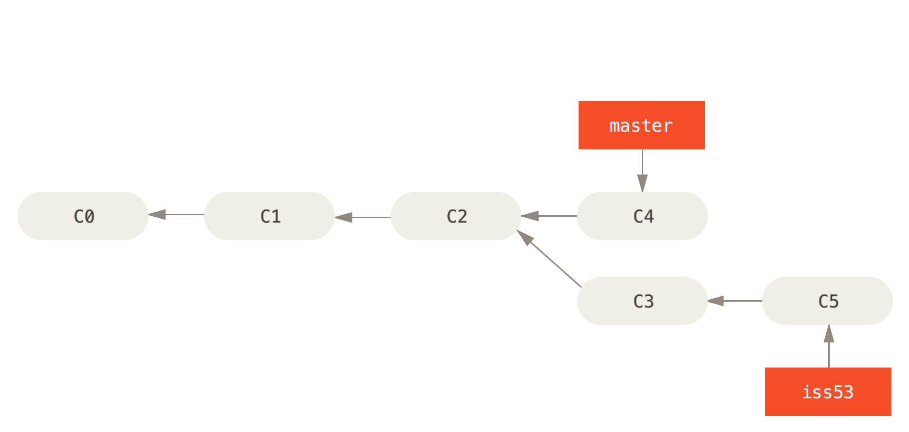
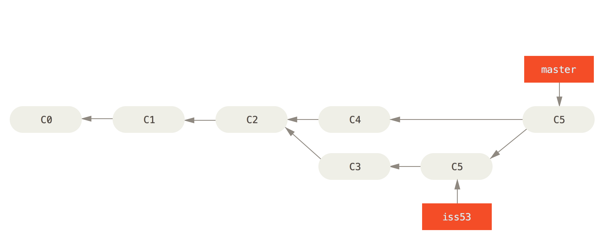

### [Presentation link](https://doubleo2.github.io/git-basics-presentation)
<!-- .element: style="display:none" -->

# Git


----

<h1><span>SVN</span> <!-- .element class="fragment highlight-current-blue" data-fragment-index="0" --> vs <span>Git</span> <!-- .element class="fragment highlight-current-blue" data-fragment-index="1" --></h1>

Notes:

SVN is **centralized**. Commits are **shared immediately**, which makes it difficult to commit unless a feature is complete. Because branches are cumbersome and your changes must be rebased onto any remote changes, development is basically **linear**. By default, **all changes are committed**.

Git is **decentralized**. Commits are **local until pushed**. You must be **explicit** about which changes to commit.

----

#### Basics: 
<!-- .element: style="text-align: left;" -->
## Getting started

```sh
$ git init
---
$ git clone git@github.com:<project/path>
```

Notes:

Copies **entire repository** to your local machine. You **cannot clone a subdirectory**. That's why it's important to **keep repos small**.

----

#### Basics: 
<!-- .element: style="text-align: left;" -->
## Commit

```sh
$ git add file_to.add or_folder_to_add/
$ git commit
```

Notes:

Files to be committed are **added explicitly**. `Commit` opens an editor for entering a commit message.

---

#### Basics: 
<!-- .element: style="text-align: left;" -->
## Lifecycle


Notes:

By default, no files in a git repository are tracked. The first time you add a file to git, it is immediately staged for commit. **Unmodified** files are identical to their corresponding file in the `HEAD` commit, while *modified* files differ from the snapshot of their corresponding file.

---

#### Basics: 
<!-- .element: style="text-align: left;" -->
## Commits


Notes:

Each commit contains a complete snapshot of the files that have changed and a pointer to it's parent commit.

----
<!-- .slide: data-background="url(img/branching.jpg)" -->

Notes:

**Branching**: If pipes can do it, so can you.

----

#### Basics: 
<!-- .element: style="text-align: left;" -->
## Branch

```sh
$ git branch <newbranch>
$ git checkout <newbranch>
---
$ git checkout -b <newbranch>
```

---

#### Basics: 
<!-- .element: style="text-align: left;" -->
## Branch


Notes:

Creating branches is lightening quick, because git just creates a new pointer to the current commit.

---

## Why?

Notes:

Why should I use branches? Suppose you discover a **critical bug** while you are in the middle of **working on a feature**. If you are working **on master**, you must **work around** your partial feature or **complete** it before you can fix the bug.

---


Notes:

If you created a branch before starting work on the feature ...

---

```sh
$ git checkout master
$ git branch hotfix
$ git commit -a
```


Notes:

... you checkout master and create the hotfix ...

*N.B.*: `commit -a` adds all modified files

---

```sh
$ git checkout master
$ git merge hotfix
```


Notes:

... and merge the hotfix into master.

Since `hotfix` is a descendant of `master`, git simply moves the `master` pointer forward when you merge. This a called a "fast-forward" merge.

---

```sh
$ git checkout iss53
$ git commit -a
```



Notes:

With the hotfix released, you can continue working on the feature you had started.

---

```sh
$ git checkout master
$ git merge iss53
```


Notes:

This time `master` is **not an ancestor** of the branch you are trying to merge, so git performs the merge by looking at three commits: the **tips** of the two branches and their **common ancestor**.

---



Notes:

Merge creates a so-called **merge commit**, which unlike a normal commit points to **more than one parent**.

----

#### Basics: 
<!-- .element: style="text-align: left;" -->
## Push

```sh
$ git push
---
$ git push <remote> <branch>
```

Notes:

By default, push sends local commits on the current branch to the remote tracking branch. In most cases, the remote tracking branch is a branch of the same name on `origin` which is the repository you originally cloned from.

----

#### Basics: 
<!-- .element: style="text-align: left;" -->
## Push failure

```sh
$ git push
To git@github.com:user/project.git
 ! [rejected]        master -> master (non-fast-forward)
error: failed to push some refs to 'git@github.com:user/project.git'
```

---

### What happened?


----

#### Basics: 
<!-- .element: style="text-align: left;" -->
## Pull

```sh
$ git pull
---
$ git fetch <remote> <branch>
$ git merge <remote>/<branch>
```

Notes:

`Pull` changes before you start working; it will reduce the chance of your `push`  being rejected.

----

#### Basics: 
<!-- .element: style="text-align: left;" -->
## Status

```sh
$ git status

On branch master
Your branch is up-to-date with 'origin/master'.
nothing to commit, working directory clean
```

Notes:

Shows **untracked**, **modified** and **staged** files.

If you are using git on the commandline, you will be using this **ALL the time**. If you are using a GUI, it will be run ALL the time for you.

----

#### Basics: 
<!-- .element: style="text-align: left;" -->
## Diff

```sh
$ git diff

$ git diff --staged
```

Notes:

Shows a unified diff of **modified** or, in the case of the staged flag, **staged** files **compared to committed files** in the `HEAD` commit of your repository.

----

#### Pro tip:
<!-- .element: style="text-align: left;" -->
## Patch

```sh
$ git add -p
$ git reset -p HEAD
$ git checkout -p HEAD
```
Notes:

The **patch** flag allows you to stage/unstage/discard **partial** files. It can also be used to **review** the changes that are being staged/unstaged/discarded.

----

#### Pro tip:
<!-- .element: style="text-align: left;" -->
## Diff viewer

```sh
$ git difftool [--staged]
```

Notes:

**Get one** and set it up so the git commandline tool can use it.

---

* **xplat**: [P4Merge](https://www.perforce.com/product/components/perforce-visual-merge-and-diff-tools), [DiffMerge](http://www.sourcegear.com/diffmerge/)
* **OS X**: FileMerge (xcode), [Kaleidoscope](http://www.kaleidoscopeapp.com/)

----

#### Pro tip:
<!-- .element: style="text-align: left;" -->
## Commit messages

Notes:

First line (subject) completes the sentence, "This commit will...". The body explains **why**, not how. Provide your future self with your current **context**.

----

### Credits

- *Warholian Pipe Branches* by Angie Harms ([CC BY-ND 2.0](https://creativecommons.org/licenses/by-nd/2.0/))
- Git diagrams from git-scm.org ([CC BY 3.0](http://creativecommons.org/licenses/by/3.0/))
